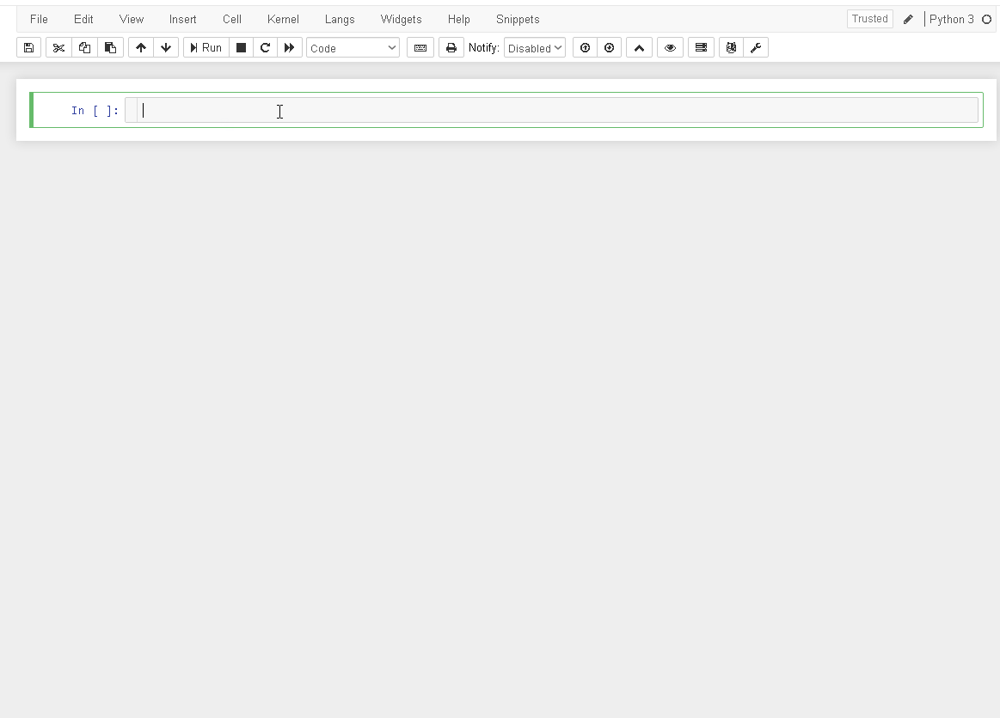

# Floating Menu for Jupyter Notebook
A similar floating menu existing in Kaggle for use to Jupyter Notebook

Floating Menu
=========

This extension add a button to enable a floating menu in active cell.

Current function:

- Move cell UP
- Move cell Down
- Delete cell
- Insert cell below "Code" 
- Insert cell below "Markdown"


Jupyter Notebook
=========

For direct insert code in input to Jupyter Notebook use: 

```javascript

%%html

<div class="alert alert-info" role="alert">
  Floating menu enabled!
</div>

<script>

var divSelected
var divSelectedInput
var divFloatingMenu

//  Insert Menu Flutuante
function CreateFloatingMenu(){

    divSelected = document.querySelector(".selected");
    divSelectedInput = divSelected.querySelector('.output_wrapper');

    divFloatingMenu = document.createElement('div')
    divFloatingMenu.setAttribute("id", "divFloatingMenu")
    
    divFloatingMenu.innerHTML =`
        <div class="container" style="width: 80%">
            <div class="text-left" style='padding-top:5px'>
                <div class="btn-group" role="group" aria-label="Basic example">
                    <button type="button" class="btn btn-success" title="Run selected cell" onclick="Jupyter.notebook.execute_selected_cells()">
                        <i class="fa-step-forward fa"></i>
                        <span class="toolbar-btn-label">Run</span>
                    </button>
                    <button type="button" class="btn btn-default" title="Move selected cells up" onclick="Jupyter.notebook.move_cell_up()">
                        <i class="fa-arrow-up fa"></i>
                    </button>
                    <button type="button" class="btn btn-default" title="Move selected cells down" onclick="Jupyter.notebook.move_cell_down()">
                        <i class="fa-arrow-down fa"></i>
                    </button>
                    <button type="button" class="btn btn-danger" title="Delete selected cell" onclick="Jupyter.notebook.delete_cell(Jupyter.notebook.get_selected_index())">
                        <i class="fa-trash fa"></i></button>
                    <button type="button" class="btn btn-warning" title="Insert code cell below" onclick="InsertCell()">
                        <i class="fa-code fa"></i>
                    </button>
                    <button type="button" class="btn btn-info" title="Insert markdown cell below" onclick="InsertCell('markdown')">
                        <i class="fa-pencil fa"></i>
                    </button>
                </div>
            </div>
        </div>
        `;

    divSelectedInput.before(divFloatingMenu)
}

// Insert Cell by Types
function InsertCell(type = 'code') {
    Jupyter.notebook.insert_cell_below(type).set_text(''); 
    Jupyter.notebook.select_next();
    Jupyter.notebook.focus_cell();
}

// Auto Show MenuFloat
var CurrentIndex
var LastIndex

$(document).on('focus', '.input_area', function (e) {
    setTimeout(function(){
        var menuFloatingElement = document.getElementById("divFloatingMenu");
        var focus=$(document.activeElement);
        CurrentIndex = Jupyter.notebook.get_selected_index()
        if (focus.is(".input_area") || $('.input_area').has(focus).length) {
            if (LastIndex == undefined){
                CreateFloatingMenu();
                console.log("Add Floating Menu in ",CurrentIndex);
                LastIndex = Jupyter.notebook.get_selected_index()
            }else{
                if (LastIndex == CurrentIndex){
                    if (menuFloatingElement){
                        console.log("Exist a Floating Menu in ",CurrentIndex);
                    }else{
                        CreateFloatingMenu();
                        console.log("Add Floating Menu in ",CurrentIndex);
                        LastIndex = Jupyter.notebook.get_selected_index()
                    };
                }else{

                    if (menuFloatingElement){
                        document.getElementById("divFloatingMenu").remove();
                        console.log("Remove Floating Menu to ",LastIndex);
                    };

                    CreateFloatingMenu();
                    console.log("Add Floating Menu in ",CurrentIndex);
                    LastIndex = Jupyter.notebook.get_selected_index()
                }
            }
        } else {

            if (menuFloatingElement){
                document.getElementById("divFloatingMenu").remove();
                console.log("Remove Floating Menu",Jupyter.notebook.get_selected_index());
            };
        }
    },0);
});

</script>

```


