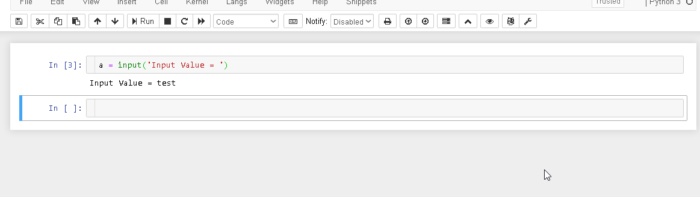

Floating Menu
=========

This extension add a button to enable a floating menu in active cell.

Current function:

- Move cell UP
- Move cell Down
- Delete cell
- Insert cell below "Code" 
- Insert cell below "Markdown"

